### Who am I?

My name is Anass Yarroudh. I'm a Data Scientist and Machine Learning Engineer at [GIM](https://www.gim.be/fr). This is my Github profile where you can find some of my open source projects and repositories.

### Collections
#### MCP & Agentic AI

> Projects exploring **Model Context Protocol (MCP)**, AI agents, tool integration, and agentic workflows.

  
  &nbsp;
  

